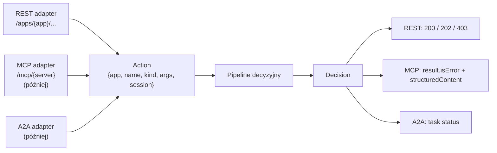

# ADR 0001 — Adaptery protokołów, REST jako pierwszy

**Status:** Zaakceptowany · 2026-10-03

## Kontekst

Proxy ma kontrolować ruch agent ↔ aplikacja, agent ↔ MCP i agent ↔ agent. Każdy protokół ma inną semantykę: MCP daje nazwę narzędzia i argumenty ze schematem, REST daje metodę, ścieżkę i body. Zespół budujący fake apki (magazyn, marketplace) potrzebuje prostego kontraktu, a apki mają też służyć ludziom przez web.

## Decyzja

1. **Rdzeń niezależny od protokołu.** Każdy adapter normalizuje wywołanie do wspólnego `Action` i formatuje decyzję w swoim protokole. Pipeline decyzyjny operuje wyłącznie na `Action`.
2. **Kolejność:** agent ↔ LLM (OpenAI-compatible) → agent ↔ app (REST) → agent ↔ MCP → agent ↔ agent (A2A).
3. **REST przez reverse proxy z prefiksem** `/apps/{app}/...`. Forward proxy (`HTTP_PROXY`) odrzucone — wymaga przechwytywania TLS.
4. **Katalog akcji** (`apps.yaml`) mapuje trasę na akcję. Nieznana trasa = DENY.
5. **API apek** — magazyn: `GET /low-stock`, `POST /purchase-orders`; marketplace: `GET /search`, `POST /orders`, `GET /merchants/{id}` (tylko dla proxy).



### Katalog akcji

```yaml
apps:
  warehouse:
    upstream: http://warehouse:8000
    routes:
      - { method: GET,  path: /low-stock,       action: list_low_stock,  kind: read }
      - { method: POST, path: /purchase-orders, action: register_po,     kind: write }
  marketplace:
    upstream: http://marketplace:8000
    routes:
      - { method: GET,  path: /search,          action: search_products, kind: read }
      - { method: POST, path: /orders,          action: place_order,     kind: write }
```

### Odpowiedzi REST dla agenta

| Decyzja | HTTP | Body |
|---|---|---|
| ALLOW | status upstreamu | body upstreamu |
| ESCALATE | `202` | `{"status": "pending_approval", "decision_id", "approval_id", "poll_url"}` |
| DENY | `403` | `{"status": "blocked", "decision_id", "message"}` |

## Konsekwencje

- MCP i A2A to kolejne adaptery, bez zmian w politykach i modelach ML.
- REST wymaga ręcznego katalogu akcji — koszt utrzymania; docelowo generowany z OpenAPI aplikacji.
- `POST /purchase-orders` (`on_order`) rozwiązuje wielokrotne zamawianie przy cyklicznym odpytywaniu i daje regułę: blokuj, gdy `on_hand + on_order >= threshold` lub było zamówienie na to SKU w oknie czasowym.

## Rozważane alternatywy

| Opcja | Dlaczego nie |
|---|---|
| Najpierw MCP | Dodatkowa praca dla zespołu apek (MCP SDK), apki i tak potrzebują REST dla webu |
| Proxy jako jeden zagregowany serwer MCP | Proxy musi być jednocześnie serwerem i klientem MCP, łączenie sesji — za dużo na MVP |
| Forward proxy (`HTTP_PROXY`) | Wymaga MITM dla HTTPS |
| Jeden endpoint magazynu (`GET /low-stock`) | Agent zamawia ten sam towar przy każdym odpytaniu, dopóki nie przyjdzie dostawa |
