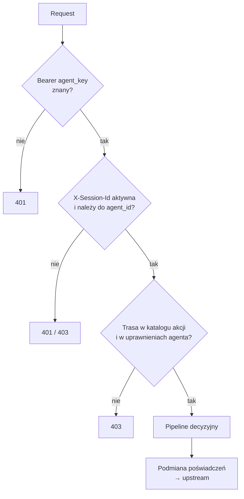
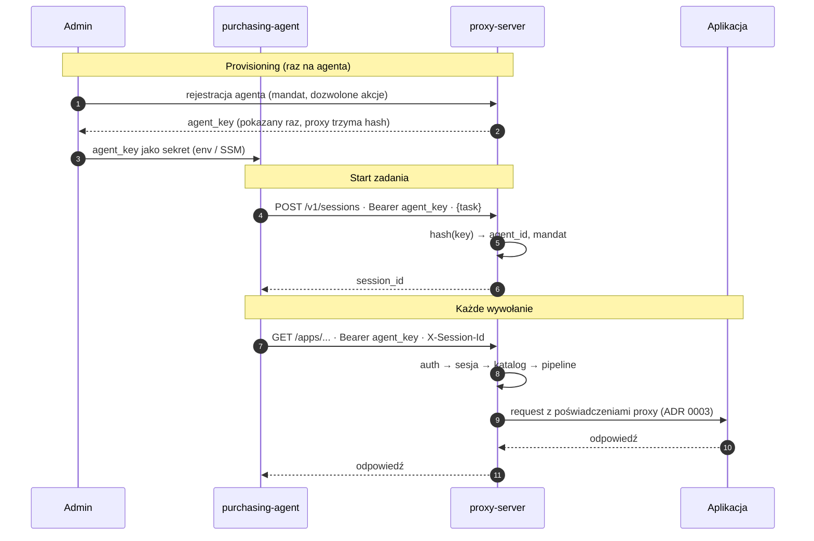
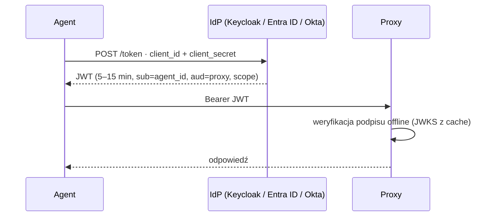

# ADR 0002 — Tożsamość agenta i sesje

**Status:** Zaakceptowany · 2026-10-03

## Kontekst

Proxy stosuje polityki per agent (mandat, dozwolone akcje, budżety) i kontrole stanowe per sesja (grounding, `qty_ratio`, zgodność z mandatem). Jeśli tożsamość lub sesję deklaruje sam agent, przejęty agent (np. przez prompt injection) może podszyć się pod agenta z szerszymi uprawnieniami albo zakładać nowe sesje, żeby gubić kontekst.

## Decyzja

1. **Stały `agent_key`** w `Authorization: Bearer`. Proxy przechowuje tylko hash (SHA-256 losowego tokenu) i na tej podstawie wyznacza `agent_id`, mandat i uprawnienia z `agents.yaml`. Brak nagłówka `X-Agent-Id`.
2. **Interfejs `Authenticator`** (`request → AgentPrincipal`), żeby później podmienić metodę bez zmian w reszcie proxy.
3. **Sesje wydaje proxy:** `POST /v1/sessions {task}` → `session_id` przypięty do `agent_id`. Kolejne requesty niosą `X-Session-Id`. `task` to niezaufany kontekst; mandat zawsze z konfiguracji.
4. **Budżety i limity per agent w oknie czasowym**, nie per sesja.
5. **OIDC na później** (S25).

## Kontrole na każdym requeście

## Przebieg

## Konsekwencje

| Zagrożenie | Status | Czym |
|---|---|---|
| Agent podaje się za innego agenta | chronione | tożsamość z klucza, nie z nagłówka |
| Agent używa sesji innego agenta | chronione | sesja przypięta do `agent_id` |
| Agent zakłada nowe sesje, żeby gubić kontekst | częściowo | limity per agent w oknie czasowym |
| Przejęty agent działa własnym kluczem | nie ta warstwa | polityki, ML, agregator |
| Wyciek `agent_key` | częściowo | unieważnienie w konfiguracji; docelowo OIDC |

`agent_key` jest długo żyjącym sekretem — rotacja ręczna. Akceptowalne na MVP.

## Na później: OIDC (S25)

OAuth2 Client Credentials — flow maszyna-maszyna, bez przeglądarki.

- **Zyski:** krótkotrwałe tokeny w ruchu, centralne wyłączanie i rotacja w IdP, proxy nie odpytuje IdP przy każdym requeście.
- **Haczyk:** `client_secret` nadal jest stałym sekretem — przesuwa się z proxy do IdP. Pełne pozbycie się stałego sekretu wymaga tożsamości workloadu (token konta serwisowego Kubernetes, rola IAM, SPIFFE) wymienianej na JWT (RFC 8693).
- **IdP:** klienci korporacyjni zwykle już mają (Entra ID, Okta, Keycloak); proxy potrzebuje tylko `issuer URL`. Na demo / dla klientów bez IdP: Keycloak (Apache 2.0) w `docker-compose`.

## Rozważane alternatywy

| Opcja | Dlaczego nie (teraz) |
|---|---|
| `X-Agent-Id` deklarowany przez agenta | Trywialne podszycie się |
| Sesje generowane przez agenta | Agent może gubić kontekst kontroli stanowych |
| OIDC od razu | Zależność od IdP, więcej pracy na hackathonie |
| mTLS / SPIFFE | Najmocniejsze, ale najwięcej pracy operacyjnej |
