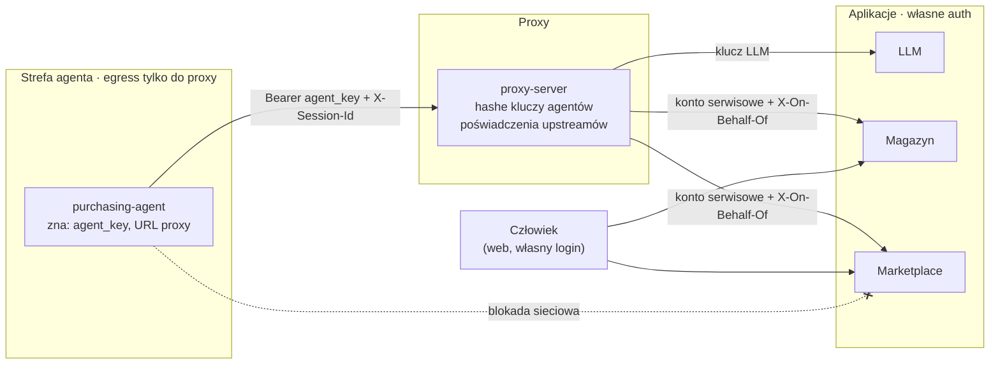

# ADR 0003 — Dostęp do aplikacji i granice zaufania

**Status:** Zaakceptowany · 2026-10-03

## Kontekst

Agent ma komunikować się wyłącznie przez proxy. Aplikacje (magazyn, marketplace) służą jednak także ludziom przez web, więc nie mogą być zbudowane wokół proxy — wymaganie „tylko proxy może wołać aplikację” przenosiłoby szczegół naszego systemu do implementacji aplikacji.

## Decyzja

Wymaganie brzmi: **agent nie ma żadnych poświadczeń do aplikacji.**

1. Uwierzytelnianie aplikacji to sprawa aplikacji: ludzie przez login w webie, integracje przez konta serwisowe / klucze API.
2. Proxy jest dla aplikacji zwykłym klientem z kontem serwisowym. Poświadczenia per app w `apps.yaml` (sekrety z env / SSM), proxy wstrzykuje je do requestu (Bearer, nagłówek z kluczem API, Basic).
3. Proxy usuwa `agent_key` z requestu przed wysłaniem do aplikacji. Dodaje `X-On-Behalf-Of: agent_id` — informacyjnie, aplikacja nie musi mu ufać.
4. Izolacja sieciowa: agent w sieci z egress tylko do proxy (Docker `internal: true`, security group w ECS).
5. Klucz do LLM (jeśli upstream go wymaga) zna tylko proxy.



```yaml
apps:
  marketplace:
    upstream: http://marketplace:8000
    auth:
      type: bearer
      token_env: MARKETPLACE_SERVICE_TOKEN
```

## Konsekwencje

- Dwie niezależne warstwy: sieć (agent nie ma trasy) i poświadczenia (agent nie ma klucza). Awaria jednej nie otwiera aplikacji, o ile aplikacja ma auth.
- Proxy wpina się w istniejące aplikacje klienta bez ich modyfikacji — wystarczy konto serwisowe.
- **Ograniczenie demo:** jeśli fake apki nie mają auth, izolacja opiera się wyłącznie na sieci.

## Rozważane alternatywy

| Opcja | Dlaczego nie |
|---|---|
| Aplikacja akceptuje tylko klucz proxy | Wymusza szczegół naszego systemu na aplikacji; blokuje użycie przez ludzi w webie |
| Agent ma własne poświadczenia do aplikacji | Agent może ominąć proxy |
| Tylko izolacja sieciowa | Jedna warstwa; błąd konfiguracji sieci otwiera dostęp |
