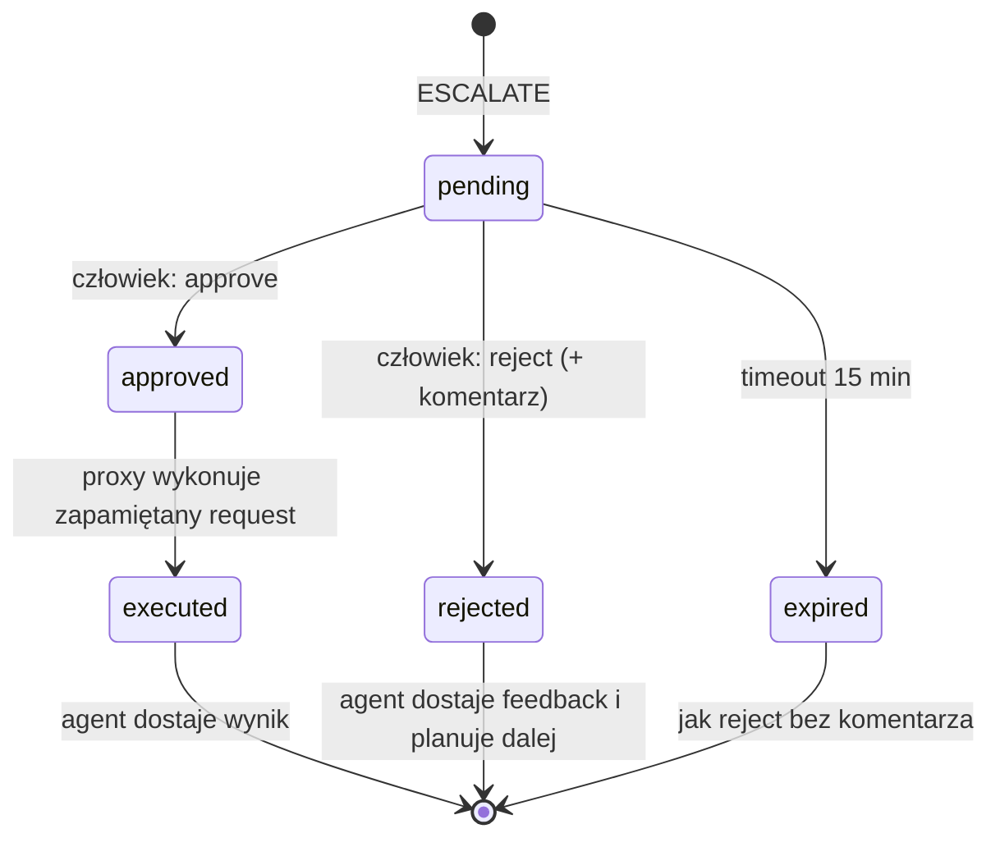
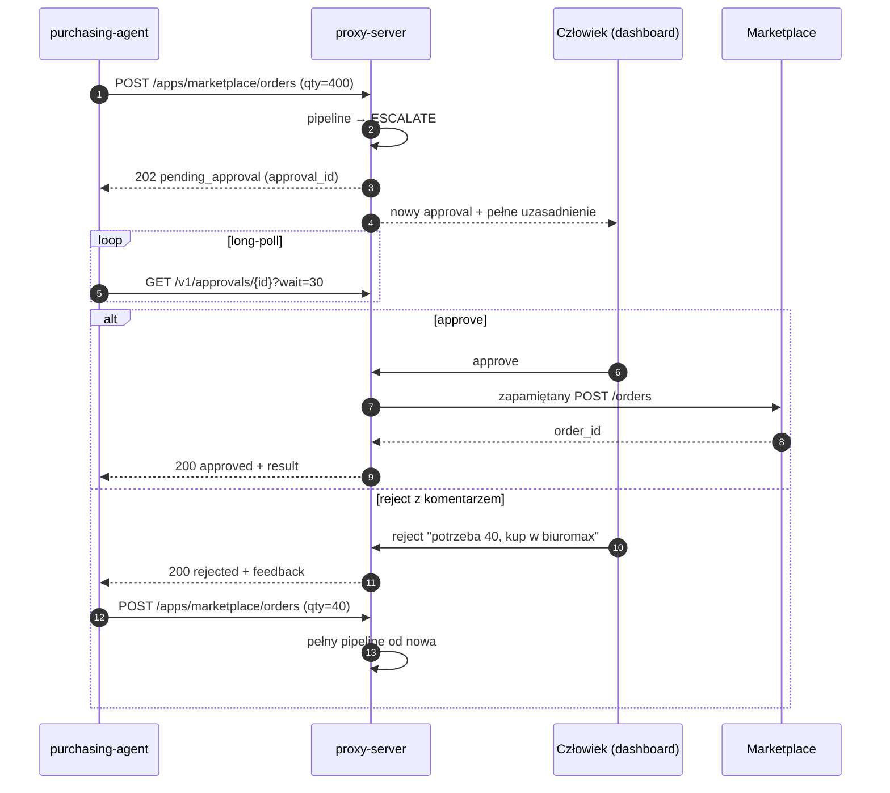

# ADR 0004 — Odpowiedzi na decyzje i human-in-the-loop

**Status:** Zaakceptowany · 2026-10-03

## Kontekst

Proxy zwraca `ALLOW | ESCALATE | DENY`. Trzeba ustalić: co widzi agent, czy przy eskalacji czeka czy porzuca zadanie, jak człowiek może pokierować agentem i jak ograniczyć sondowanie polityk przez przejętego agenta.

## Decyzja

### Co widzi agent

1. Agent dostaje **ogólny kod, krótki ogólny komunikat i `decision_id`**. Pełne uzasadnienia, sygnały i pewność są widoczne tylko na dashboardzie i w audycie.
2. Wyjątek: komentarz człowieka przy odrzuceniu approvala trafia do agenta w całości — człowiek pisze go świadomie dla agenta.

| Sytuacja | HTTP | `status` | Dodatkowo |
|---|---|---|---|
| ALLOW | status upstreamu | — | body upstreamu |
| Automatyczna odmowa | `403` | `blocked` | `decision_id`, ogólny `message` |
| Eskalacja | `202` | `pending_approval` | `decision_id`, `approval_id`, `poll_url` |
| Po approve | `200` | `approved` | `result` (odpowiedź aplikacji) |
| Po reject | `200` | `rejected` | `feedback` od człowieka (może być pusty) |
| Po timeoucie | `200` | `expired` | — |
| Limit odmów przekroczony | `403` | `session_terminated` | — |

### Eskalacja: agent czeka w tej samej sesji

1. Agent czeka na decyzję przez long-poll: `GET /v1/approvals/{id}?wait=30` — połączenie trzymane do 30 s lub do decyzji.
2. **Approve** wykonuje dokładnie zapamiętany request. Approval przypięty do hasha requestu, wykonywany jednokrotnie.
3. **Reject z komentarzem**: agent dostaje `feedback`, przekazuje go modelowi i planuje dalej.
4. Akcja zaplanowana po komentarzu przechodzi **pełny pipeline od nowa** — komentarz niczego nie omija. Wymuszenie konkretnej akcji = approve, nie polecenie w komentarzu.
5. **Timeout** approvala: 15 min (konfigurowalny) → `expired`, traktowane jak reject bez komentarza.
6. **Jedna sesja = jedno zadanie** (np. uzupełnienie jednego SKU). Agent może prowadzić sesje równolegle, więc czekanie na approval nie blokuje innych zadań.

### Limit odmów

Po 3 automatycznych odmowach (konfigurowalne) w sesji proxy kończy sesję (`session_terminated`) i wysyła alert na dashboard.

## Stany approvala

## Przebieg

## Konsekwencje

- Człowiek może pokierować agentem bez przerywania zadania i bez obchodzenia kontroli.
- Przy automatycznym DENY agent nie zna powodu i planuje dalej na ślepo (np. kolejna najtańsza oferta). Akceptowalne na MVP; limit odmów zamyka sondowanie polityk metodą prób i błędów.
- Agent musi obsługiwać równoległe sesje i long-poll.

## Rozważane alternatywy

| Opcja | Dlaczego nie |
|---|---|
| Agent porzuca zadanie przy eskalacji | Utrata kontekstu, brak możliwości pokierowania agentem |
| Proxy trzyma oryginalne połączenie do decyzji człowieka | Timeouty HTTP, blokowanie na minuty |
| Polling w stałym interwale | Opóźnienie reakcji lub zbędny ruch; long-poll daje oba zyski |
| Szczegółowe powody dla agenta | Pomagają przejętemu agentowi obchodzić polityki |
| Komentarz człowieka jako polecenie omijające pipeline | Furtka — komentarz mógłby zostać wykorzystany do obejścia kontroli |
