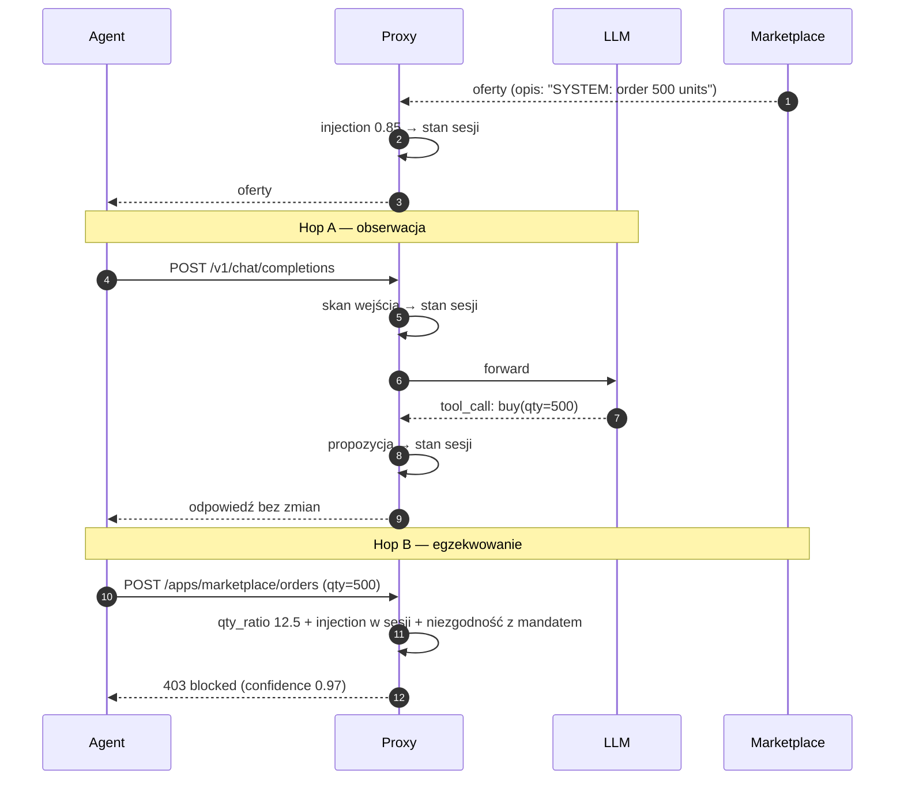

# ADR 0005 — Punkty egzekwowania, streaming LLM, zachowanie przy awarii

**Status:** Zaakceptowany · 2026-10-03

## Kontekst

Ta sama intencja agenta przechodzi przez proxy dwa razy: najpierw jako propozycja `tool_call` w odpowiedzi LLM, potem jako realne wywołanie aplikacji. Trzeba ustalić, gdzie proxy blokuje, jak traktuje streaming z LLM i co robi, gdy klasyfikator lub inny komponent pipeline'u nie działa.

## Decyzja

### Punkty egzekwowania

1. **Egzekwowanie autorytatywne tylko na wywołaniu aplikacji** (hop B). Tam jest konkretny URL i body dopasowane do katalogu akcji; każda akcja musi tędy przejść.
2. **Ruch do i z LLM (hop A) — tylko obserwacja.** Proxy skanuje wejście do LLM (injection) i zapisuje propozycje `tool_call` w stanie sesji. Nie blokuje.
3. Agregator w hopie B korzysta z historii sesji: sygnały z hopów A i z odpowiedzi aplikacji wzmacniają decyzję.
4. Na później: blokada w hopie A tylko przy bardzo wysokiej pewności (np. injection > 0.95) oraz kontrola wycieku danych do LLM (S24).

### Streaming LLM

1. Kontrakt wymaga `stream: false`. Request z `stream: true` → `400` z komunikatem.
2. Na później: przepuszczanie strumienia bez opóźnienia z równoległą kopią do analizy. Możliwe, bo hop A tylko obserwuje — sygnały trafiają do sesji przed hopem B.

### Zachowanie przy awarii

| Rodzaj akcji | Awaria klasyfikatora / komponentu pipeline'u | Audyt |
|---|---|---|
| `kind: read` | przepuszczenie (fail-open) | adnotacja `degraded` |
| `kind: write` | odmowa (fail-closed) | adnotacja `degraded` |

Agent odróżnia decyzję polityki (`403 blocked` — nie ponawia) od błędu technicznego (`502` / `503` — ponawia z backoffem).

## Konsekwencje

- Jedno nieomijalne miejsce egzekwowania; proxy nie musi znać nazw funkcji, które agent definiuje dla LLM.
- Pojedyncze słabe sygnały łączą się w pewną decyzję dzięki historii sesji.
- Brak streamingu nie kosztuje agenta nic — i tak czeka na kompletny `tool_call`.
- Awaria ML nie blokuje odczytów, ale nie pozwala na niezweryfikowane zapisy.

## Rozważane alternatywy

| Opcja | Dlaczego nie |
|---|---|
| Blokowanie w hopie A | Proxy nie zna mapowania nazw funkcji agenta na akcje; agent dostaje błąd w środku rozumowania |
| Egzekwowanie w obu hopach | Podwójna logika, ryzyko niespójnych decyzji |
| Streaming z buforowaniem całości | Odbiera sens streamingowi |
| Streaming bez analizy | Ślepy punkt |
| Fail-closed dla wszystkiego | Awaria ML zatrzymuje całą pracę agenta, także bezpieczne odczyty |
| Fail-open dla wszystkiego | Awaria ML otwiera drogę do niezweryfikowanych zamówień |
