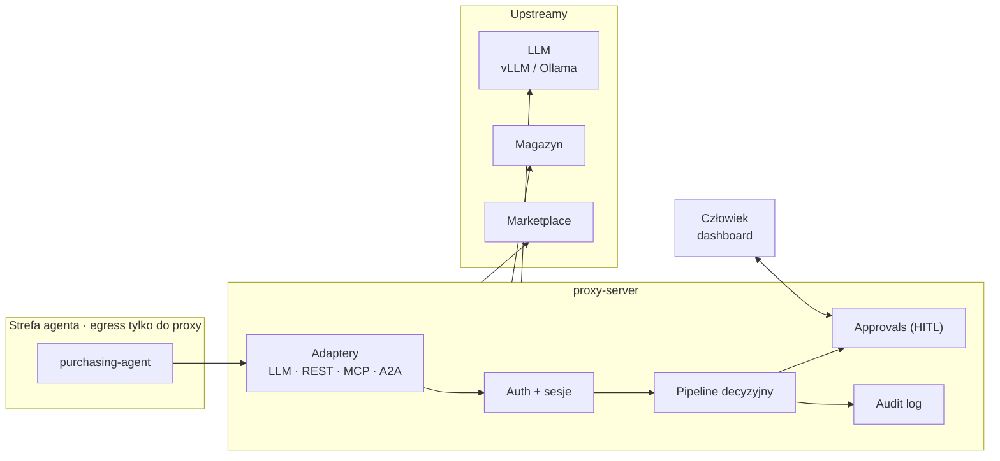
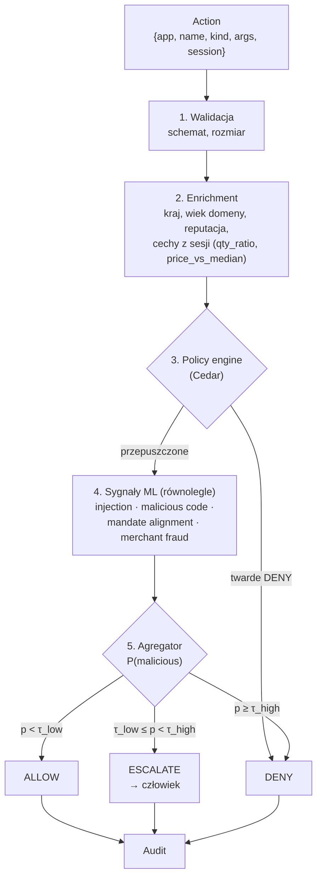
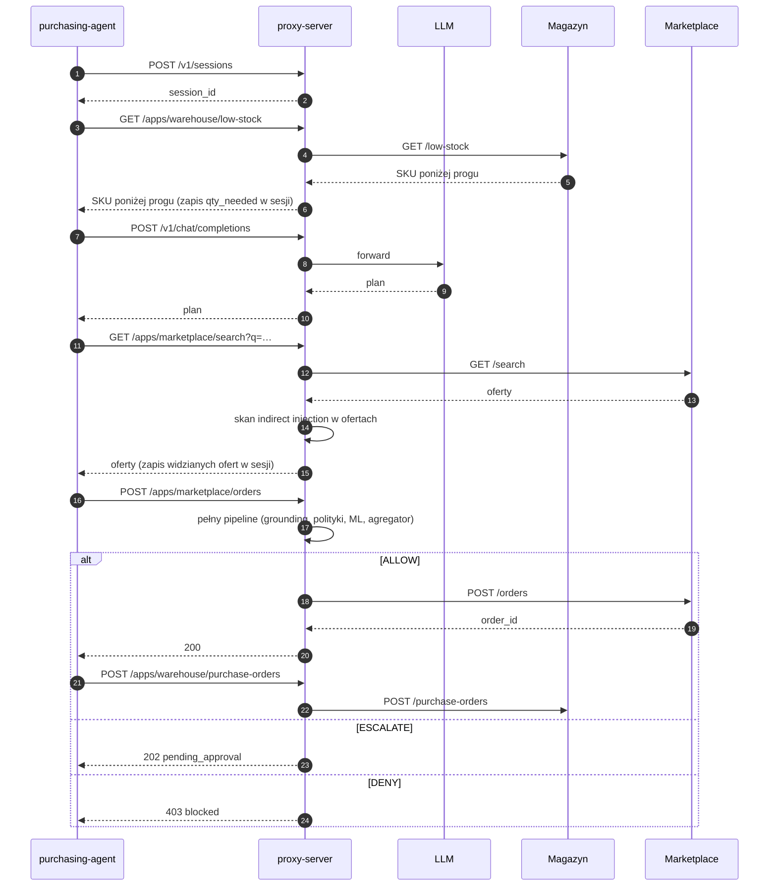

# Architektura — przegląd

Proxy jest jedynym punktem wyjścia agenta. Każde wywołanie LLM, aplikacji, MCP i innych agentów przechodzi przez proxy, które podejmuje decyzję `ALLOW | ESCALATE | DENY` z poziomem pewności i uzasadnieniem.

## Komponenty

## Pipeline decyzyjny

Progi `τ` konfigurowalne per typ akcji (`place_order` ostrzej niż `search`).

## Use case referencyjny — agent zakupowy

