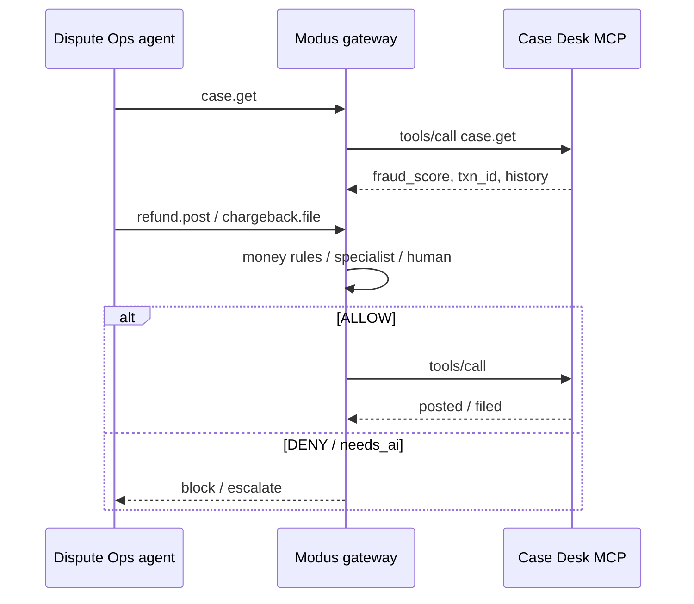

# Kontrakt API — Case Desk

**Status:** Draft · 2026-10-03  
**App:** `case-desk-agent` (canonical) · also mirrored under `card-network-agent` / `dispute-case-desk-mcp`  
**Stack:** TypeScript, MCP Express, `postgres`, Zod (same as Network Portal)  
**Schema:** `dispute_case_desk` (Shopping-Warehouse Database)  
**Konsumenci:** Dispute Ops agent (przez Modus / MCP), demo (Postman / REST)

## Kontekst

Wewnętrzny desk bankowy: case + refund + chargeback. Mutacje pieniężne (`refund.post`, `refund.adjust`, `chargeback.file`) są tym, co Modus musi gate’ować. Aplikacja trzyma walidację cienką (bez „sekretnej” polityki).



## Konwencje

- Surface główny: **MCP** `POST /mcp`.
- REST `/v1/*` — lustro narzędzi.
- `refund.post` / `chargeback.file` wspierają `idempotency_key` (demo retries).
- OpenAPI: `GET /openapi.json` · Postman: `GET /postman.json`
- Pliki: `openapi/dispute-case-desk.openapi.yaml`, `postman/dispute-case-desk.postman_collection.json`

## Endpointy HTTP

| Endpoint | Cel |
|---|---|
| `GET /health` | liveness |
| `POST /demo/reset` | seed obu schematów |
| `GET /openapi.json` / `GET /postman.json` | kontrakty maszynowe |
| `POST /mcp` | MCP JSON-RPC |
| `GET /v1/cases` | `case.list` |
| `GET /v1/cases/{case_id}` | `case.get` |
| `PATCH /v1/cases/{case_id}` | `case.update` |
| `POST /v1/refunds` | **money out** |
| `POST /v1/refunds/{id}/adjust` | adjust / shrink analogue |
| `POST /v1/chargebacks` | **irreversible ops** |

**Polityki / rule packs są tylko w Modus** — nie ma tabeli `policy_docs` w Case Desk. Setup: `card-network-agent/docs/MODUS_SETUP.md`.

## Narzędzia MCP

| Tool | Args | Notes |
|---|---|---|
| `case.list` | `status?`, `txn_id?` | read |
| `case.get` | `case_id` | fraud_score + history |
| `case.update` | `case_id`, `status?`, `notes?`, `reason_code?` | low-risk write |
| `refund.post` | `case_id`, `amount_eur`, `kind` | provisional \| final \| clawback |
| `refund.adjust` | `refund_id`, `delta_eur`, `reason` | |
| `chargeback.file` | `case_id`, `reason_code`, `evidence_note?` | |
| `demo.reset` | — | |

## Fixtures (minimum)

| Id | Intent |
|---|---|
| `case_189_unrecognized` | linked `txn_189_travel`, fraud_score `0.55` |
| `case_12_clear_fraud` | linked small txn, fraud_score `0.92` |

Shared ids z Network Portal: `txn_id`, `case_id`, `dispute_id`, `amount_eur`, `country`.

Default base URL (local): `http://127.0.0.1:4102`.

## Jak używać (skrót)

```bash
cd case-desk-agent
npm run seed && npm run start
# or: cd card-network-agent && npm run start:case-desk
```

1. OpenAPI: `http://127.0.0.1:4102/openapi.json`
2. Postman: zaimportuj jeden plik `contracts/dispute-ops/dispute-case-desk.postman_collection.json` (zmienne w kolekcji)
3. `POST /demo/reset` → `GET /v1/cases/case_189_unrecognized`
4. Modus: zarejestruj `http://127.0.0.1:4102/mcp`

Pełniejszy przewodnik: [dispute-ops/README.md](./dispute-ops/README.md).
