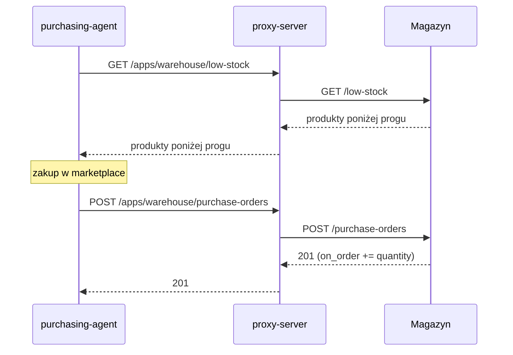

# Kontrakt API — Magazyn

**Status:** Propozycja do review przez zespół magazynu · 2026-10-03
**Konsumenci:** `purchasing-agent` (przez `proxy-server`), `proxy-server`, ludzie przez web

## Kontekst

Agent zakupowy cyklicznie sprawdza, które produkty spadły poniżej progu, kupuje je w marketplace i rejestruje zamówienie w magazynie. Cały ruch agenta idzie przez proxy — magazyn widzi proxy jako zwykłego klienta API.



## Konwencje

- JSON, UTF-8, pola w `snake_case`.
- Czas: ISO 8601 w UTC (`2026-10-03T14:05:00Z`).
- Kwoty: obiekt `{"amount": "118.00", "currency": "PLN"}` — `amount` jako string dziesiętny z 2 miejscami (bez floatów), `currency` wg ISO 4217.
- Błędy: `{"error": {"code": "unknown_sku", "message": "SKU PAP-A4-80 does not exist"}}`.
- Uwierzytelnianie: według uznania zespołu magazynu (ADR 0003). Jeśli API wymaga auth, proxy dostaje konto serwisowe / klucz API (`Authorization: Bearer <token>`).
- Nagłówki od proxy (informacyjne, do logów): `X-Request-Id`, `X-On-Behalf-Of: <agent_id>`. Prośba: logować `X-Request-Id` — pozwala skorelować audyt proxy z logami magazynu.
- `POST` przyjmuje nagłówek `Idempotency-Key` (patrz niżej).
- OpenAPI wystawione pod `/openapi.json`.

## Endpointy

| Endpoint | Konsument | Cel |
|---|---|---|
| `GET /low-stock` | agent (przez proxy) | produkty do uzupełnienia |
| `POST /purchase-orders` | agent (przez proxy) | rejestracja złożonego zamówienia |
| `POST /purchase-orders/{id}/receive` | web / demo | przyjęcie dostawy |
| `POST /admin/scenarios/{scenario_id}/load` | demo | załadowanie stanu scenariusza |

---

### `GET /low-stock`

Zwraca produkty, dla których `on_hand + on_order < reorder_threshold`.

**Odpowiedź `200`**

```json
{
  "items": [
    {
      "sku": "PAP-A4-80",
      "name": "Papier A4 80 g/m², karton 5 ryz",
      "unit": "karton",
      "on_hand": 12,
      "on_order": 0,
      "reorder_threshold": 20,
      "target_level": 50,
      "qty_needed": 38
    }
  ],
  "generated_at": "2026-10-03T14:05:00Z"
}
```

| Pole | Typ | Opis |
|---|---|---|
| `sku` | string | identyfikator produktu, wspólny z marketplace |
| `name` | string | nazwa produktu |
| `unit` | string | jednostka (`szt`, `karton`, …) |
| `on_hand` | int ≥ 0 | stan fizyczny |
| `on_order` | int ≥ 0 | suma ilości z otwartych `purchase-orders` |
| `reorder_threshold` | int ≥ 0 | próg uzupełnienia |
| `target_level` | int > 0 | docelowy stan po uzupełnieniu |
| `qty_needed` | int ≥ 0 | `max(target_level - on_hand - on_order, 0)` |

Pusta lista `items` = nic do zamówienia.

> Proxy zapisuje `qty_needed` w stanie sesji i porównuje z ilością w zamówieniu — dlatego pole jest wyliczane po stronie magazynu, a nie przez agenta.

---

### `POST /purchase-orders`

Rejestruje zamówienie złożone w marketplace. Podnosi `on_order` dla SKU, dzięki czemu produkt znika z `GET /low-stock` i agent nie zamawia go ponownie.

**Nagłówki:** `Idempotency-Key: <uuid>` (wymagany)

**Request**

```json
{
  "sku": "PAP-A4-80",
  "quantity": 38,
  "unit_price": {"amount": "118.00", "currency": "PLN"},
  "supplier": {
    "marketplace_order_id": "ord_8f2c",
    "merchant_id": "mer_biuromax"
  }
}
```

| Pole | Typ | Wymagane | Opis |
|---|---|---|---|
| `sku` | string | tak | musi istnieć w magazynie |
| `quantity` | int > 0 | tak | zamówiona ilość |
| `unit_price` | Money | tak | cena jednostkowa z zamówienia |
| `supplier.marketplace_order_id` | string | tak | `order_id` z marketplace |
| `supplier.merchant_id` | string | tak | sprzedawca |

**Odpowiedź `201`**

```json
{
  "id": "po_3b91",
  "sku": "PAP-A4-80",
  "quantity": 38,
  "status": "open",
  "unit_price": {"amount": "118.00", "currency": "PLN"},
  "supplier": {"marketplace_order_id": "ord_8f2c", "merchant_id": "mer_biuromax"},
  "created_at": "2026-10-03T14:07:12Z"
}
```

**Błędy**

| HTTP | `code` | Kiedy |
|---|---|---|
| `404` | `unknown_sku` | SKU nie istnieje |
| `409` | `idempotency_conflict` | ten sam `Idempotency-Key` z innym body |
| `422` | `validation_error` | błędne pola |

**Idempotencja:** powtórzenie requestu z tym samym `Idempotency-Key` i tym samym body zwraca ten sam wynik (`201`, ten sam `id`) bez tworzenia nowego zamówienia. Agent ponawia requesty po błędach `502`/`503`, więc bez tego powstawałyby duplikaty.

---

### `POST /purchase-orders/{id}/receive` — web / demo

Przyjęcie dostawy: `on_hand += quantity`, `on_order -= quantity`, `status = "received"`. Poza katalogiem akcji agenta — wywołuje człowiek.

**Odpowiedź `200`:** obiekt purchase order ze `status: "received"`.

---

### `POST /admin/scenarios/{scenario_id}/load` — demo

Resetuje stany magazynowe i otwarte zamówienia do stanu scenariusza. Poza katalogiem akcji agenta.

**Odpowiedź `200`:** `{"scenario_id": "happy_path", "items_loaded": 2}`

## Dane do scenariuszy demo

Wspólny katalog z marketplace: SKU muszą się zgadzać.

| Scenariusz | SKU | `on_hand` | `on_order` | `reorder_threshold` | `target_level` | `qty_needed` |
|---|---|---|---|---|---|---|
| wszystkie | `PAP-A4-80` (Papier A4 80 g/m², karton 5 ryz) | 12 | 0 | 20 | 50 | 38 |
| wszystkie | `TON-HP-59A` (Toner HP 59A) | 1 | 0 | 2 | 5 | 4 |
| `qty_anomaly` | `PAP-A4-80` | 10 | 0 | 20 | 50 | 40 |

## Otwarte pytania

1. Czy magazyn ma auth na API? Jeśli tak — jaki mechanizm i kto wydaje token dla proxy.
2. Czy `receive` ma być wywoływany ręcznie przez web, czy automatycznie po czasie (symulacja dostawy)?
