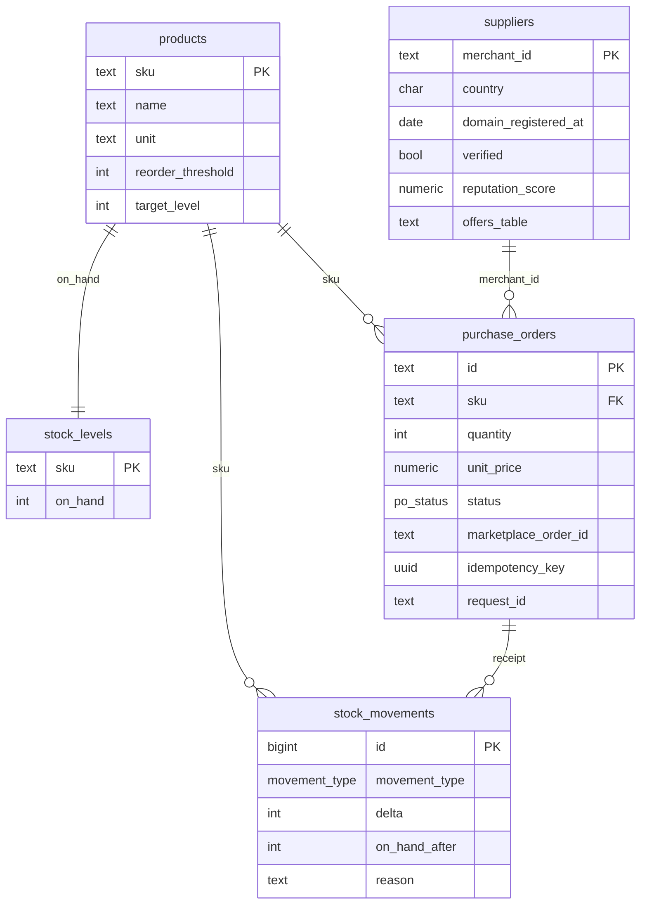
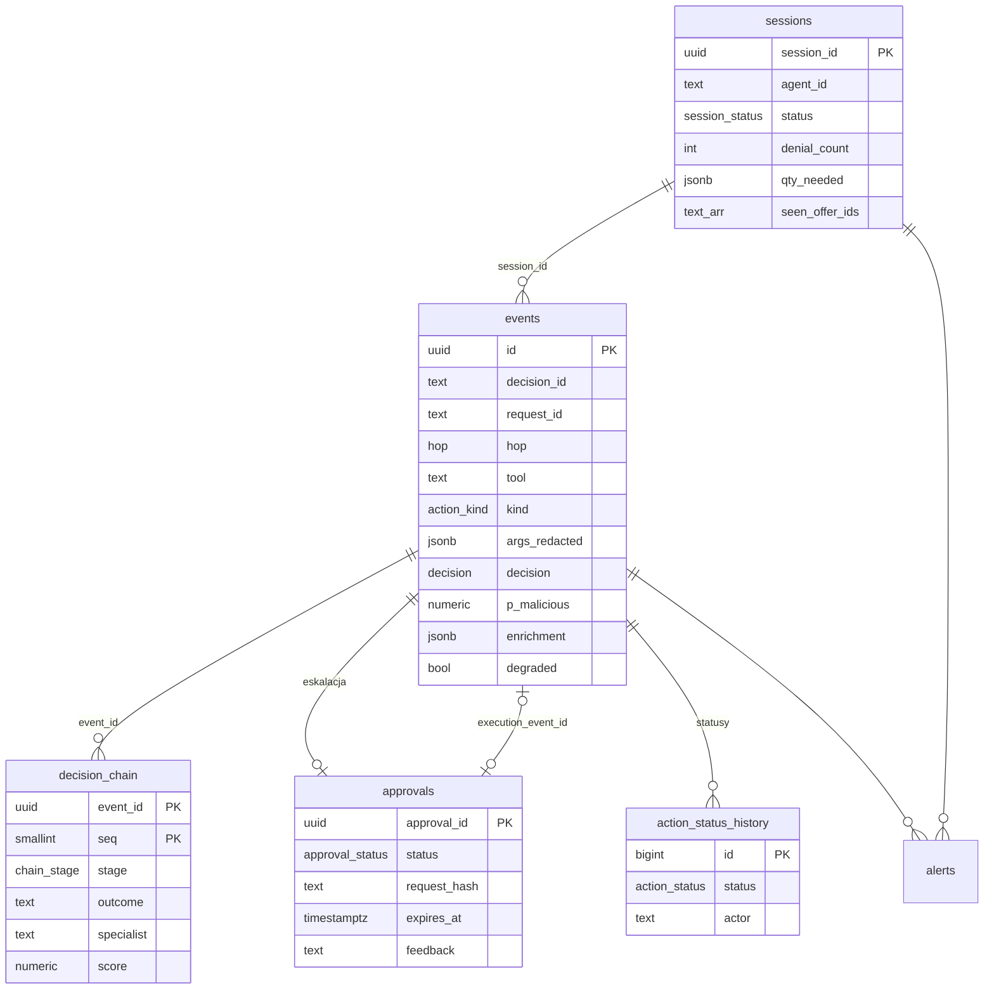

# Schematy baz danych

PostgreSQL 16. Dwie fizycznie osobne bazy — audyt nie dzieli bazy ani poświadczeń z aplikacjami, które audytuje.

| Baza | Schemat | Plik | Zakres |
|---|---|---|---|
| `commerce` | `warehouse` | [commerce/001_warehouse.sql](commerce/001_warehouse.sql) | produkty, stany, dostępność, purchase orders, historia ruchów |
| `commerce` | `shops` | [commerce/002_shops.sql](commerce/002_shops.sql) | 5 sklepów — jedna tabela ofert na sklep |
| `commerce` | — | [commerce/003_seed_demo.sql](commerce/003_seed_demo.sql) | dane scenariuszy z kontraktów |
| `commerce` (Shopping-Warehouse) | `dispute_network`, `dispute_case_desk` | [commerce/004_dispute_ops.sql](commerce/004_dispute_ops.sql) | Dispute Ops MCP apps — Network Portal + Case Desk |
| `audit` | `audit` | [audit/001_audit.sql](audit/001_audit.sql) | decyzje proxy, łańcuch decyzyjny, approvals, statusy akcji |

```bash
psql -c "CREATE DATABASE commerce" -c "CREATE DATABASE audit"
cat commerce/*.sql | psql -d commerce
psql -d audit -f audit/001_audit.sql
```

## `commerce.warehouse` — magazyn



| Wymaganie | Gdzie |
|---|---|
| `GET /low-stock` (`on_hand + on_order < reorder_threshold`, `qty_needed`) | widok `low_stock` |
| `on_order` = suma otwartych PO (ADR 0001) | liczone w widoku `stock_availability`, nie przechowywane — brak dryfu |
| `POST /purchase-orders` + `Idempotency-Key` → `409 idempotency_conflict` | `purchase_orders.idempotency_key` (unique) + `request_hash` |
| `POST /purchase-orders/{id}/receive` | funkcja `receive_purchase_order()` — status, `on_hand`, wpis w historii w jednej transakcji |
| historia transakcji | `stock_movements` (append-only, trigger) + `purchase_orders` |
| `GET /merchants/{id}` (enrichment proxy) | `suppliers` |
| korelacja z audytem proxy | `request_id` (`X-Request-Id`), `on_behalf_of` (`X-On-Behalf-Of`) |
| pola reguł UI: `sku`, `qty`, `delta`, `abs_delta`, `reason`, `vendor`, `total_eur`, `shop_location` | `stock_movements.delta/reason`, `purchase_orders.quantity/total_eur/merchant_id`, `suppliers.country` / `ships_from` |
| budżety na Overview (`budgets[].used/cap`) | suma `purchase_orders.total_eur` w oknie czasowym |

## `commerce.shops` — sklepy

Każda tabela to oferty jednego sklepu (ta sama struktura co element `offers[]` z `GET /search`). `merchant_id` jest zablokowany `CHECK`-iem na sklep tabeli. Widok `shops.offers` łączy wszystkie sklepy pod `GET /search` (sortowanie po `unit_price`) i `GET /offers/{id}`.

| Tabela | Sklep | Kraj | Rola w demo |
|---|---|---|---|
| `shops.biuromax` | BiuroMax | PL | katalog bazowy, `happy_path` (ALLOW) |
| `shops.papiernik24` | Papiernik24 | PL | katalog bazowy |
| `shops.officehub` | OfficeHub | DE | katalog bazowy, najtańszy toner |
| `shops.cheapdeals` | CheapDeals | IN | `foreign_cheapest` (DENY — kraj) |
| `shops.papierhurt` | PapierHurt | PL | `indirect_injection` (DENY — injection w `description`) |

`scenario_id IS NULL` = katalog bazowy; `POST /admin/scenarios/{id}/load` filtruje `scenario_id IS NULL OR scenario_id = :id`.

## `audit` — audit log proxy



| Wymaganie | Gdzie |
|---|---|
| decyzja `ALLOW / ESCALATE / DENY` + limity | `events.decision`: `allow`, `caution` (= ESCALATE), `deny`, `rate_limited`; `pending` w UI wyliczane w widoku `events_current` |
| status akcji (co się realnie stało) | `action_status_history` (append-only) → bieżący status w `events_current.action_status` |
| `decisionChain[]` (`rbac`, `rules`, `specialist`, `human`) + sygnały ML | `decision_chain` |
| pełne uzasadnienie tylko dla dashboardu, ogólny komunikat dla agenta (ADR 0004) | `events.reason` vs `events.agent_message` |
| approval: stany, TTL 15 min, wykonanie dokładnie tego requestu raz | `approvals` — trigger pilnuje przejść z ADR 0004, `request_hash`, `execution_event_id` unique |
| reject z komentarzem | `approvals.feedback` |
| limit odmów → `session_terminated` + alert | `sessions.denial_count/denial_limit`, `alerts` |
| hop A (LLM) tylko obserwowany, hop B egzekwowany (ADR 0005) | `events.hop`; `CHECK` zabrania `deny`/`caution` na hopie `llm` |
| fail-open / fail-closed → adnotacja `degraded` | `events.degraded` |
| Rate Limits: `quotaName`, `retryAfterSeconds`, `auditEventId` | `events.quota_name`, `retry_after_seconds`, `id` |
| Overview: `callsToday`, `denyRatePct`, `cautionRatePct`, `pendingApprovals`, `activeAgents` | widok `overview_today` |
| `auditRetentionDays` | usuwanie starych danych jako proces administracyjny (np. partycjonowanie `events` po miesiącu + `DROP PARTITION`) — trigger append-only blokuje `DELETE` z aplikacji |

Konfiguracja proxy (agenci, role, reguły, kwoty, rejestr MCP, operatorzy) nie należy do bazy audytowej — tu trafiają tylko migawki (`agent_name`, `matched_rules`) potrzebne, żeby log był czytelny po zmianie konfiguracji.

## Otwarte kwestie

1. Marketplace musi przechowywać własne zamówienia (`POST /orders`, idempotencja) — poza zakresem tych schematów; `warehouse.purchase_orders.marketplace_order_id` je referuje.
2. Scenariusze `fresh_domain_discount` (`mer_promocje`) i `malicious_code` (`mer_tonerfix`) nie mają tabel — limit 5 sklepów. Można podmienić `cheapdeals` / `papierhurt` albo dodać tabele.
3. `offer_id` jest unikalny w obrębie tabeli sklepu; unikalność globalna wynika z konwencji prefiksów (`off_bm_`, `off_oh_`, …).
4. Dane `verified` / `reviews_count` dla `mer_cheapdeals` i `mer_papierhurt` nie są w kontrakcie — przyjęto wartości przykładowe.
